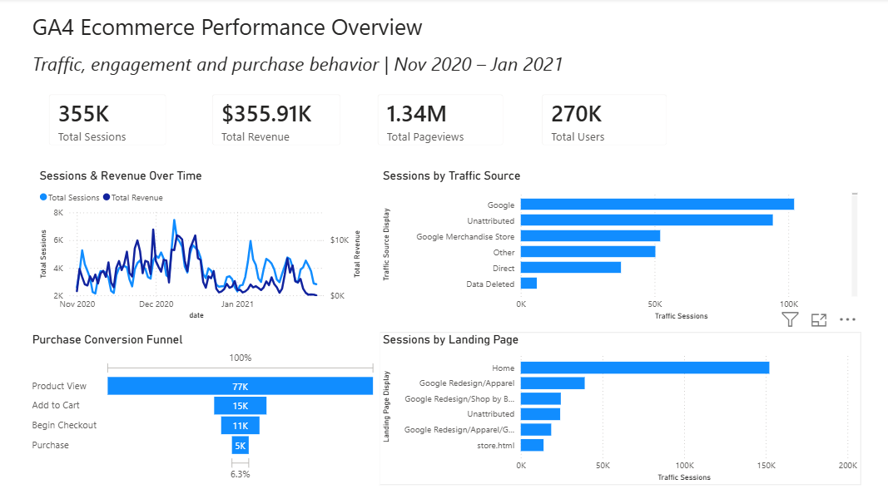
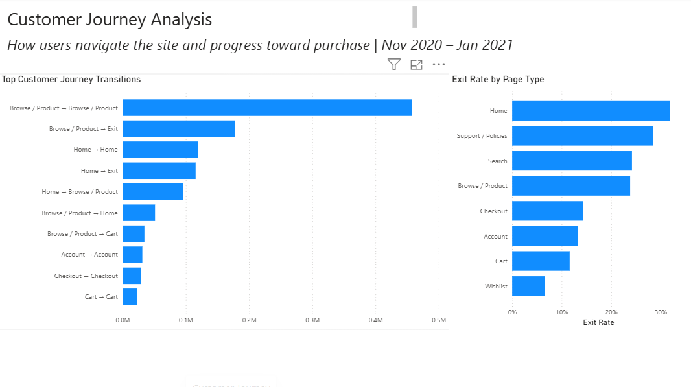
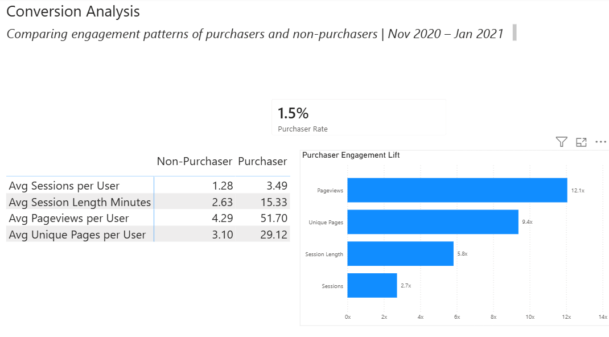

# GA4 Analytics Engineering & Power BI Portfolio

An end-to-end analytics portfolio project using Google Analytics 4 ecommerce
event data, BigQuery, dbt, and Power BI.

**Data pipeline:** GA4 → BigQuery → dbt → Power BI

The project demonstrates how raw event-level web analytics data can be
transformed into analysis-ready models and used to answer questions about
traffic, customer journeys, conversion, and purchaser behavior.

## Project Overview

This project uses Google's public GA4 obfuscated ecommerce sample dataset.

The analysis covers approximately November 2020 through January 2021 and
focuses on three areas:

- Overall ecommerce traffic and conversion performance
- Customer navigation and exit behavior
- Behavioral differences between purchasers and non-purchasers

The project includes the analytics pipeline as well as the final Power BI
report. Raw GA4 event data is queried in BigQuery, transformed with dbt into
staging and analytical models, and loaded into a Power BI semantic model for
reporting and analysis.

## Architecture

GA4 Public Sample Data
        ↓
Google BigQuery
        ↓
dbt Staging Models
        ↓
dbt Dimensions & Analytical Marts
        ↓
Power BI Semantic Model
        ↓
Interactive Power BI Report

## Business Questions

The project was designed to answer questions such as:

- How did sessions and revenue change over time?
- Which traffic sources generated the most sessions?
- Which landing pages received the most traffic?
- Where do users drop out of the purchase funnel?
- How do users move between major types of pages?
- Which page types have the highest exit rates?
- How does the behavior of purchasers differ from non-purchasers?

## dbt Transformation Layer

The dbt project separates source preparation from downstream analytical
models.

### Staging

GA4 source data is prepared in `models/staging/ga4`, including:

- Event data
- Event parameters
- Item data
- Session-level data

The staging layer provides cleaned and reusable inputs for downstream models.

### Dimensions

Reusable dimensional data includes a date dimension as well as dimensions
created in the GA4 marts for users, pages, and items.

### Analytical Marts

The `models/marts/ga4` directory contains models supporting several levels of
analysis, including:

- Events and pageviews
- Sessions and daily performance
- Traffic sources and landing pages
- Funnel progression
- Engagement and scroll behavior
- Content and item performance
- Exit behavior
- User summaries
- Customer journey paths

Several models were created at different grains to support specific analytical
questions rather than forcing all reporting requirements into a single fact
table.

## Power BI Semantic Model

Power BI uses a multi-fact analytical model in which shared dimensions such as
date, users, and pages filter fact tables at different grains.

Examples include:

- Daily performance
- Events
- Pageviews
- Traffic-source sessions
- Funnel stages
- User journey transitions
- User-level summaries

Relationships are primarily many-to-one with single-direction filtering from
dimensions to facts.

A separate measures table is used to organize DAX measures, and a disconnected
metric table supports the purchaser engagement comparison.

## Power BI Report

The report contains three analytical pages.

The Power BI report file is not included in the repository due to its size. Report pages are provided below as screenshots, while the dbt transformation models and project code are included in the repository.

### 1. Ecommerce Performance Overview

Provides a high-level view of ecommerce performance, including:

- Total sessions
- Total revenue
- Total pageviews
- Total users
- Sessions and revenue over time
- Sessions by traffic source
- Sessions by landing page
- Purchase conversion funnel

The purchase funnel follows progression from Product View through Add to Cart,
Begin Checkout, and Purchase.

#### Report Preview



### 2. Customer Journey Analysis

Examines how users navigate through the ecommerce site.

Because the source dataset contains many individual and obfuscated URLs, page
paths were grouped into interpretable page types such as:

- Home
- Browse / Product
- Cart
- Checkout
- Account
- Search
- Support / Policies
- Wishlist

The analysis shows the most common transitions between page types and compares
exit rates across page categories.

#### Report Preview



### 3. Conversion Analysis

Compares engagement behavior between purchasers and non-purchasers.

Metrics include:

- Average sessions per user
- Average session length
- Average pageviews per user
- Average unique pages viewed

Purchasers represented approximately **1.5% of users** in the analyzed data but
showed substantially greater engagement.

Compared with non-purchasers, purchasers generated approximately:

- **2.7x** as many sessions per user
- **5.8x** longer average session duration
- **12.1x** as many pageviews per user
- **9.4x** as many unique pages viewed

#### Report Preview



## Key Findings

Several patterns emerged from the analysis:

- Purchasers were a small share of total users but were much more highly
  engaged than non-purchasers.
- Product browsing dominates customer navigation activity.
- Movement between Home and Browse / Product pages represents a substantial
  portion of common navigation paths.
- Exit behavior varies considerably by page type.
- The conversion funnel narrows substantially between product viewing and
  purchase.

These findings demonstrate how event-level GA4 data can be transformed into
behavioral and conversion analysis rather than being limited to basic traffic
reporting.

## Data Quality and Modeling Decisions

Google's public GA4 ecommerce dataset is obfuscated and contains several
characteristics that require interpretation during modeling.

Examples encountered during development included:

- Missing traffic-source values
- GA4-generated traffic-source labels such as `(direct)`, `<Other>`, and
  `(data deleted)`
- Obfuscated or irregular page URLs
- Different scopes for user acquisition and session-level traffic data
- Event-date conversion and Power BI compatibility issues
- Revenue fields requiring validation to ensure revenue was associated with
  appropriate purchase activity

Rather than treating these values as normal business data, transformations and
display fields were used where appropriate to make the final report easier to
interpret while retaining the underlying source information.

For example, blank traffic sources are displayed as **Unattributed**, and
several GA4-generated source labels are presented in more readable form.

Page URLs were also grouped into semantic page types for customer-journey
analysis because analysis of thousands of individual obfuscated URLs would not
produce a useful business-level view.

## Development Challenges

Several issues required investigation and revision during development rather than straightforward transformation of the source data.

Examples include:

- Diagnosing inflated revenue values and revising item-level revenue logic so revenue was associated with appropriate purchase activity
- Resolving GA4 event-date type differences between BigQuery/dbt models and Power BI
- Investigating missing traffic-source attribution and distinguishing session-level traffic information from first-user acquisition scope
- Designing a multi-fact Power BI model with shared dimensions while preserving appropriate filter behavior
- Reconstructing customer navigation paths from event-level pageview data and grouping irregular URLs into business-readable page types
- Testing and refining Power BI relationships and visual interactions so selections produced analytically meaningful results

These decisions were validated through intermediate queries, model testing, and comparison of aggregate results before the final report was assembled.

## Tools & Technologies

- **Google Analytics 4** — source event data
- **Google BigQuery** — cloud data warehouse
- **dbt** — SQL transformation and analytical modeling
- **GitHub** — version control
- **Power BI** — semantic modeling, DAX, visualization, and interactive
  reporting

## Repository Structure

```text
models/
├── dimensions/
│   └── dim_date.sql
│
├── staging/ga4/
│   ├── sources.yml
│   ├── stg_ga4_event_params.sql
│   ├── stg_ga4_events.sql
│   ├── stg_ga4_items.sql
│   └── stg_ga4_sessions.sql
│
└── marts/ga4/
    ├── dim_items.sql
    ├── dim_pages.sql
    ├── dim_users.sql
    ├── fct_content_performance.sql
    ├── fct_daily_overview.sql
    ├── fct_engagement.sql
    ├── fct_events.sql
    ├── fct_exit_pages.sql
    ├── fct_funnels.sql
    ├── fct_item_performance.sql
    ├── fct_landing_pages.sql
    ├── fct_pageviews.sql
    ├── fct_scroll_depth.sql
    ├── fct_session_summary.sql
    ├── fct_sessions.sql
    ├── fct_traffic_sources.sql
    ├── fct_user_journey.sql
    ├── fct_user_journey_paths.sql
    └── fct_user_summary.sql
